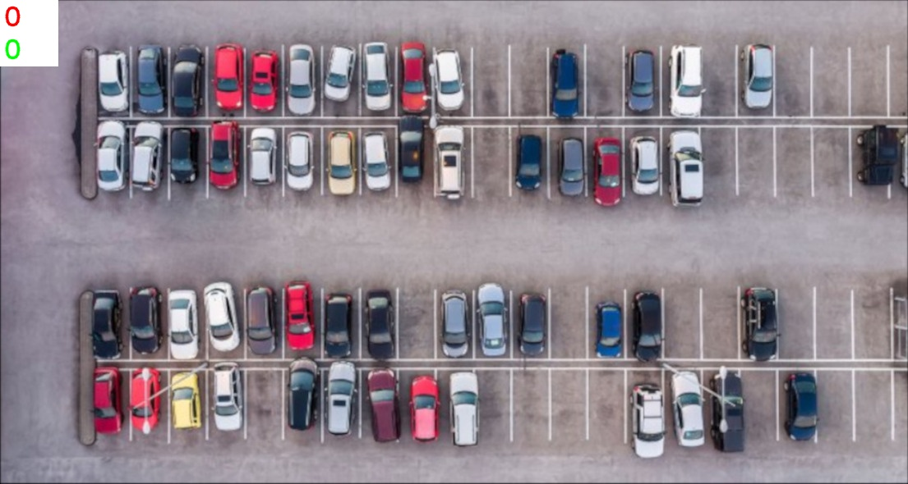
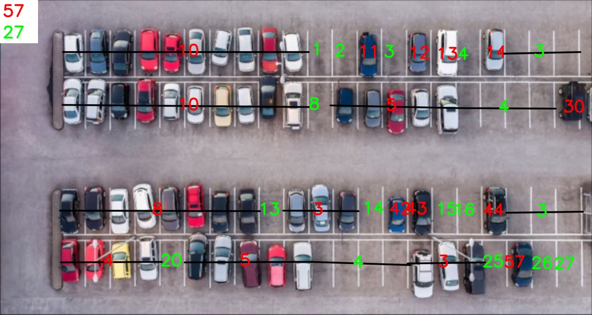

# Car Park Count Labeller
This project supports the user to count the empthy and full car park. It is a opencv project for learning basic image processes with high level GUI programming.

##  Example Results

### <p style='text-align: center;'> Input Image </p>


### <p style='text-align: center;'> Output Image </p>


## Aim of the project
- Supporting the user to labelling to empty and full park areas and finding out the total number of 
- these. Main motivation of developing this project to imporve myself basic opencv processes  and high level GUI programming.

## Used The Concepts
- OOP concepts
- Opencv High Level GUI Programming
- Opencv Basic Image Processing
- Doc String
- Python Type Annotation

## How To Use This Project

### Running the project
- Set your working directory as the project folder.
- You can install required environment following environment/environment_installation_instructions.md file. 
- Then you can run the project by following the following code:
    ```
    python app.py
    ```
### Controlling with the project
- Drawing and counting  __the full car park__
    - you can click left  mouse button. It will draw the its order.
    - you can also click and drag, it will draw a line and calculates the corresponding fulled car park count. 
- Drawing and counting the __empty car park__
    - you will do same thing above with mouse middle button instead of clicking left mouse button.

- __Exit__ from the project
    - just click __esc__ button on your keyboard. (When your Operating System Selected the project window)
- __Saving__ the results
    - just click __s__ button on your keyboard. (When your Operating System Selected the project window)


