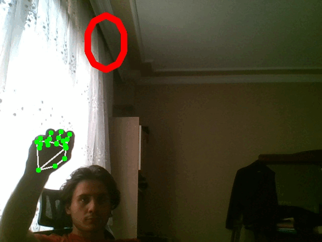

# finger_counter
- This project aims to detect and track human hand then count the number of upped fingers. 

## Example Results
- 

## Problem Defination
- Finding out the number of upped fingers in the image.

## solution.
- Detecting  human hand.
- Tracking and extracting the landsmarks form hand.
- Parsing the human hand ROI into areas to determinate the finger wheter it is upped or not.
- Checking the every parsed areas to update the finger count.

## Used The Concepts
- OOP concepts
- Opencv High Level GUI Programming
- Opencv Basic Image Processing
- Real Time Image Detection and Tracking through mediapipe
- Doc String
- Python Type Annotation

## How To Use This Project

### Running the project
- Set your working directory as the project folder.
- You can install required environment following environment/environment_installation_instructions.md file. 
- Then you can run the project by following the following code:
    ```
    python app.py

### Controlling with the project
- __Exit__ from the project
    - just click __q__ button on your keyboard. (When your Operating System Selected the project window)
- __Saving__ the results
    - just click __s__ button on your keyboard. (When your Operating System Selected the project window)

## Note 
- CarParkingPos  is a pickle file which stores the empty car parking positions.  The car park areas represented as rectangle and they stored with coordinate of  its top left point.
