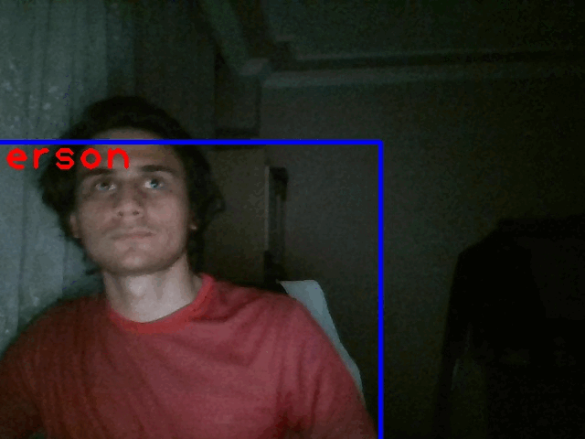
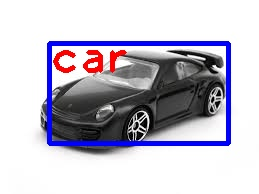
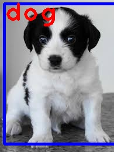
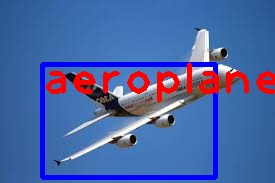

# Car-parking-Detection
- This project aims to Detect and classfy the object using yolo_v3 pre-trained deep learning model with open cv.

## Example Results    
  
 

## Problem Defination
- Detect and classfy the object.

## solution.
- Loading and configurating the pre-trained deep learning model.
- Runing the model on images and  real time streaming videos.
- Extracting the detected object properties.
- Drawing the results using opencv image processing functions.

## Used The Concepts
- OOP concepts
- Opencv High Level GUI Programming
- Opencv Basic Image Processing
- Real Time Image Detection
- Convolutional Deep Learning model architecture (Yolo_v3)
- Doc String
- Python Type Annotation

## How To Use This Project

### Running the project
- Set your working directory as the project folder.
- You can install required environment and model following environment/environment_installation_instructions.md file. 
- Then you can run the project by following the following code:
    ```
    python app.py

### Controlling with the project
- __Exit__ from the project
    - just click __q__ button on your keyboard. (When your Operating System Selected the project window)
- __Saving__ the results
    - just click __s__ button on your keyboard. (When your Operating System Selected the project window)
