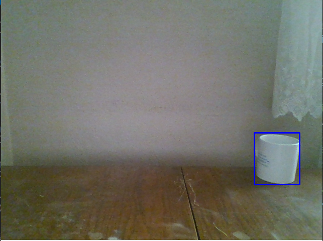
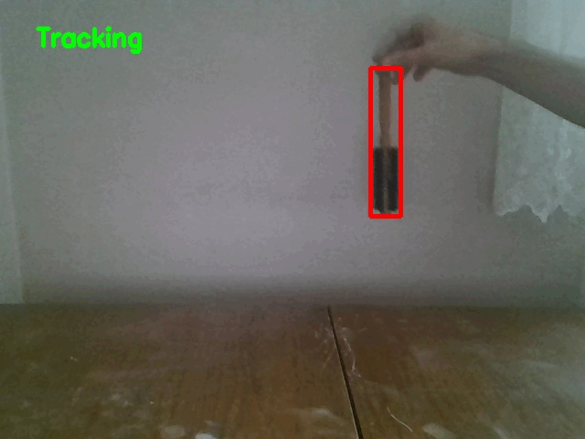

# Car-parking-Detection
- This project aims to track any object which slected by the user through GUI.

## Example Results
Referanced Object          |  Object Tracking
:-------------------------:|:-------------------------:
  |  
  |  

## Problem Defination
- Tracking the any object.

## solution.
- Selecting the object.
- Extracting the selected object bounding box.
- Finding out the properties of the object through through median flow tracking technique. 
- Following these properties from image to find out present bounding box of the object.

## Used The Concepts
- OOP concepts
- Opencv High Level GUI Programming
- Opencv Basic Image Processing
- Real Time Object Tracking
- Doc String
- Python Type Annotation

## How To Use This Project

### Running the project
- Set your working directory as the project folder.
- You can install required environment following environment/environment_installation_instructions.md file. 
- Then you can run the project by following the following code:
    ```
    python app.py

### Controlling with the project
- __Exit__ from the project
    - just click __q__ button on your keyboard. (When your Operating System Selected the project window)
- __Saving__ the results
    - just click __s__ button on your keyboard. (When your Operating System Selected the project window)
